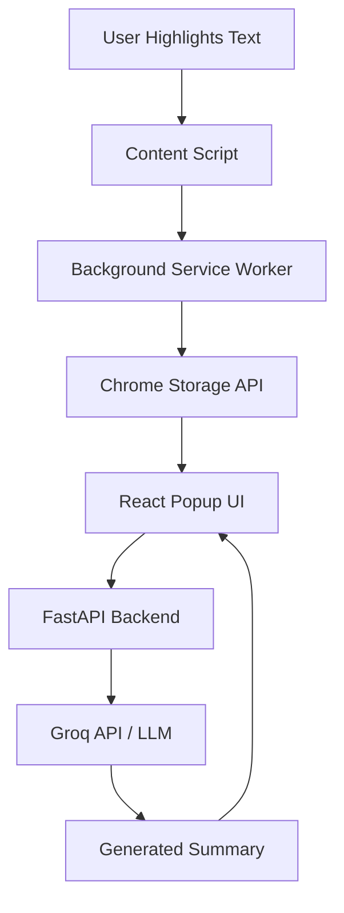

# Briefly — AI-Powered Browser Assistant

## 1. Overview

Briefly is an AI-powered browser extension designed to enhance reading, research, and productivity directly within the browser. Users can highlight text on any webpage to generate concise AI summaries and interact with large language models for deeper understanding. Built using React, TypeScript, FastAPI, and LLM APIs, Briefly aims to bring seamless AI assistance into everyday web browsing.

---

## 2. Tech Stack

### Frontend

* React
* TypeScript
* Vite
* CSS3

### Browser Extension

* Chrome Extension Manifest V3
* Content Scripts
* Background Service Workers
* Chrome Storage API

### Backend

* FastAPI
* Python
* Uvicorn

### AI

* Groq API
* Llama 3.1 8B Instant

### Version Control

* Git
* GitHub

---

## 3. Problem Statement

Modern users frequently consume long articles, documentation, research papers, and technical content online. Switching between browser tabs and external AI tools interrupts workflow and reduces productivity. Briefly addresses this challenge by integrating AI-powered summarization and assistance directly into the browsing experience.

---

## 4. System Notes & Core Components

* **Text Selection Pipeline:** Captures highlighted text from webpages using content scripts.
* **Cross-Tab Synchronization:** Utilizes Chrome Storage APIs for real-time updates across tabs.
* **AI Summarization Engine:** Sends selected text to a FastAPI backend connected to an LLM provider.
* **State Management:** React Hooks (`useState`, `useEffect`) manage popup state and UI updates.
* **Event-Driven Architecture:** Storage listeners dynamically update the UI when selections change.
* **API Abstraction Layer:** LLM providers can be swapped without modifying frontend code.

---

## 5. Architecture (Flowchart)



---

## 6. Repository Structure

```text
Briefly/
├── backend/
│   ├── main.py
│   ├── .env
│   └── requirements.txt
│
├── public/
│   ├── favicon.svg
│   └── icons.svg
│
├── src/
│   ├── assets/
│   ├── background/
│   │   └── index.ts
│   ├── content/
│   │   └── index.ts
│   ├── popup/
│   │   └── index.tsx
│   ├── components/
│   ├── services/
│   ├── pages/
│   ├── main.tsx
│   └── index.css
│
├── manifest.json
├── package.json
├── vite.config.ts
└── README.md
```

---

## 7. Key Features

* AI-powered text summarization
* Browser text selection
* Cross-tab synchronization
* Dynamic popup updates
* Scrollable summary interface
* React state management
* FastAPI backend integration
* Real-time communication between content scripts and popup UI

---

## 8. Local Setup

---

## 9. GitHub Actions Workflow

---

## 10. Generated Artifacts

* `dist/` — Production build generated by Vite.
* Browser extension bundle files.
* API logs and backend responses.

---

## 11. Compatibility

### Frontend

* Node.js 18+
* Chrome/Chromium browsers

### Backend

* Python 3.9+
* FastAPI
